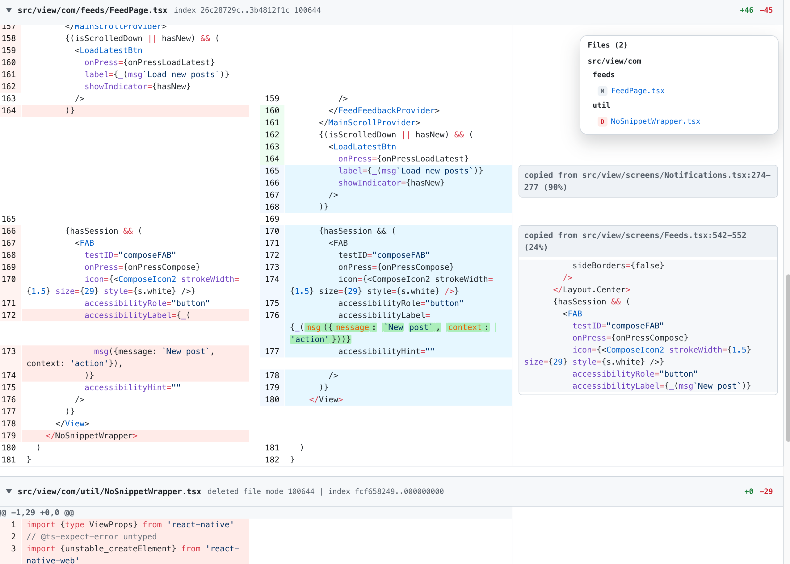

# copydiff

`copydiff` is a Bun + TypeScript helper that augments `git diff` output with copy/clone awareness using `jscpd` while preserving Git's moved-line coloring.

- Detect moved code (across files, using git color-moved)
- Detect similar code (across files, using `jscpd`)



## Install

```bash
bun i -g @houkanshan/copydiff
```

## Usage

Filter mode:

```bash
copydiff abc123...efg456
```

Generate HTML output:

```bash
copydiff base...head --html out.html
```

HTML output includes syntax highlighting, diff-style background blocks, and copy highlights with expandable source details.

Wrapper mode:


## Options

- `--stdin` read diff from stdin.
- `--html <path>` write a light-mode HTML diff with copy highlights and expandable source details.
- `--no-fold-pure` disable folding for pure copies.
- `--copy-color <spec>` set copy highlight color using git color syntax (defaults to `color.diff.newMoved`).
- `--no-copy-color` disable copy highlighting.
- `--pure-threshold <0..1>` similarity threshold for pure copies (default `0.98`).
- `--min-fold-lines <n>` minimum lines to fold (default `12`).
- `--min-lines <n>` minimum lines for `jscpd` (default `8`).
- `--min-tokens <n>` minimum tokens for `jscpd` (default `min-lines * 2`).
- `--ignore <glob,glob>` ignored globs for `jscpd`.
- `--cache <on|off>` enable clone cache (default `on`).
- `--verbose` log `jscpd` output.
- `--diff-config <force|respect>` set git diff config mode for wrapper mode (default `force`).
- `--scan-scope <all|changed-types>` scan the whole repo (`all`, default) or only files with extensions present in the diff (`changed-types`).
Note: `.gitignore` is always honored for clone scanning.

## Exit codes

- `0` success
- `2` invalid args
- `3` `jscpd` failure

## Local Development

```bash
bun install
bun link
```
